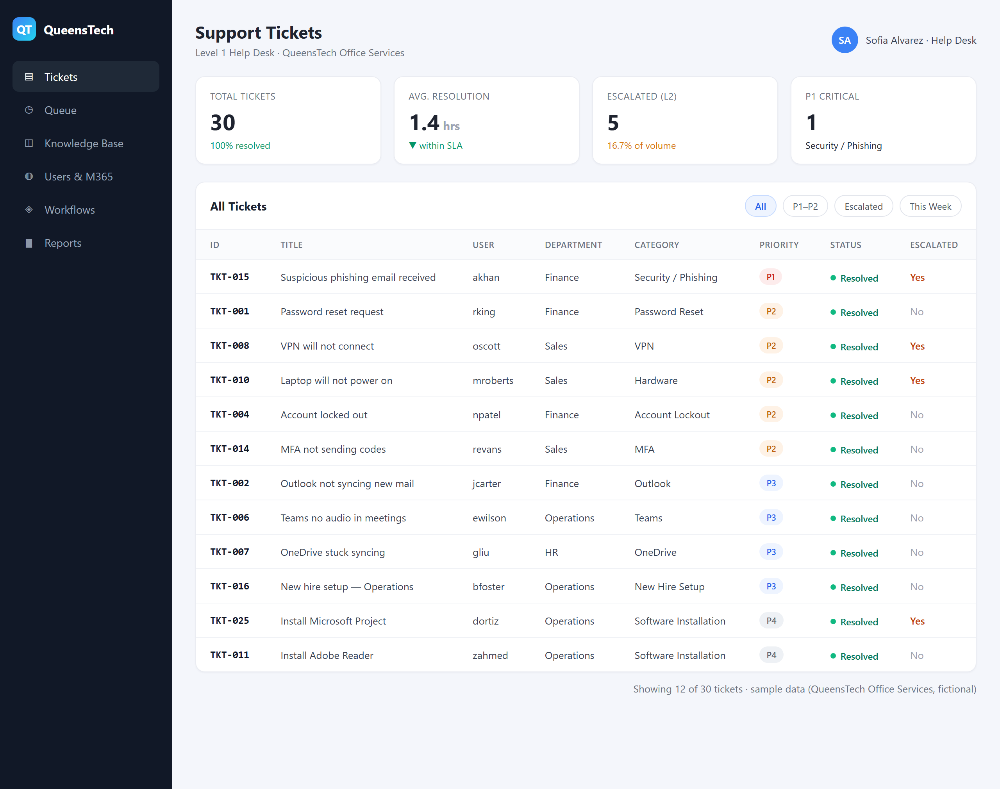
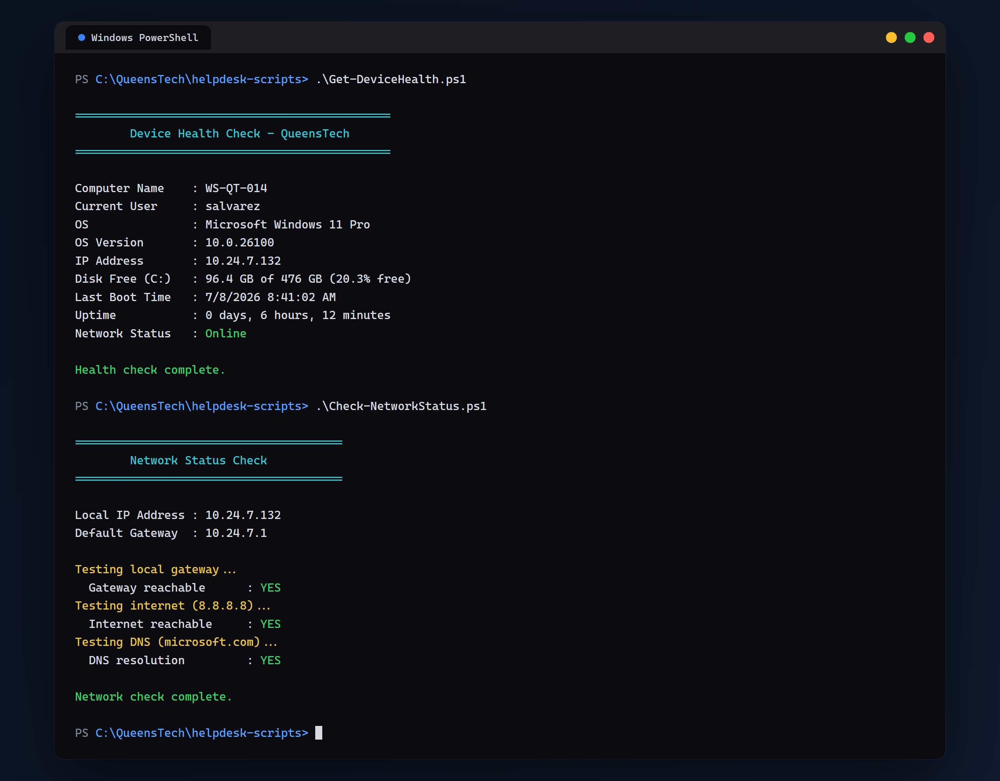
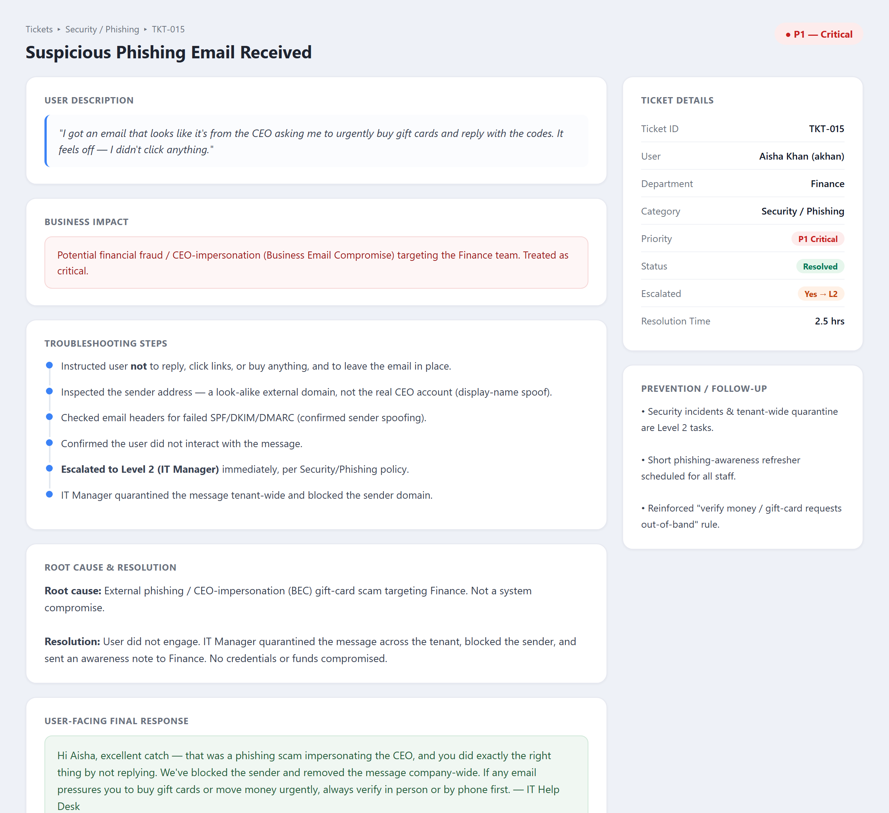
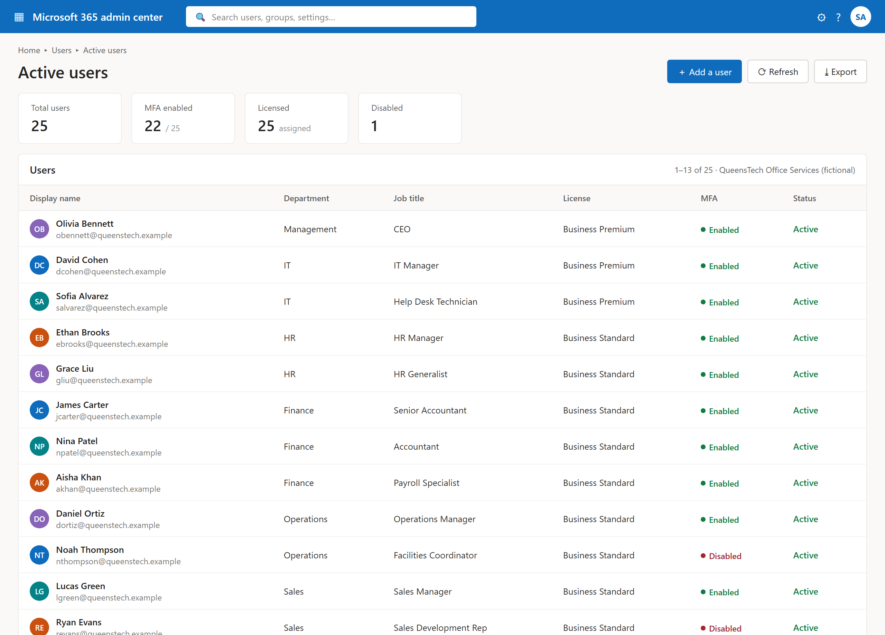
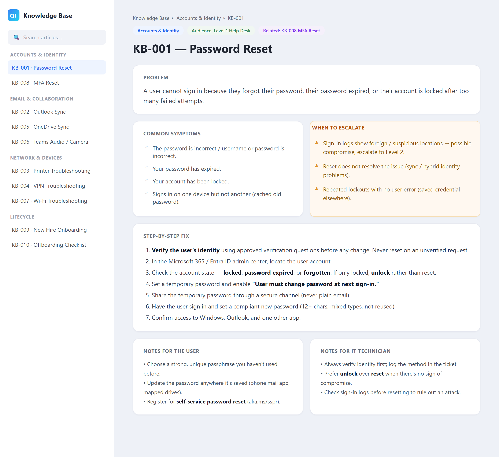

# Modern IT Help Desk + Microsoft 365 Lab

> A hands-on Level 1 IT support lab that documents real help desk work end to end — ticketing, troubleshooting, knowledge base, Microsoft 365 / Entra ID administration, identity lifecycle, and PowerShell automation — against a realistic Microsoft 365 environment.


A Level 1 IT support lab built around a fictional 25-person company, **QueensTech Office Services**. It documents help desk work end to end: ticket handling, troubleshooting, knowledge base articles, Microsoft 365 / Entra ID user administration, onboarding and offboarding procedures, and PowerShell automation for common support tasks.

**Relevant roles:** Level 1 IT Support · Help Desk · Service Desk Analyst · Desktop Support · IT Support Assistant.

> [!NOTE]
> All data in this repository is fictional. It contains no real company information, user data, credentials, or secrets.

## Preview

A quick look at the lab in action — a Level 1 ticket queue and the read-only PowerShell diagnostics a technician runs at the desk. *(All screens use fictional QueensTech sample data.)*

| Ticket Dashboard | PowerShell Diagnostics |
|:---:|:---:|
| [](screenshots/ticket-dashboard.png) | [](screenshots/powershell-output.png) |
| 30 tickets with priority, status, and SLA metrics | `Get-DeviceHealth.ps1` and `Check-NetworkStatus.ps1` |

More views in [Screenshots](#screenshots) below.

## Contents

- 30 support tickets covering the common Level 1 categories, each with troubleshooting steps, root cause, resolution, and a user-facing response.
- 10 knowledge base articles with step-by-step fixes and escalation guidance.
- 6 process documents: onboarding, offboarding, password reset, access request, escalation, and MFA reset.
- 7 PowerShell scripts for device, disk, network, and inventory checks (most are read-only).
- Sample company data: 25 users, 9 groups, and support metrics in CSV.
- 3 Mermaid diagrams: help desk flow, Microsoft 365 user lifecycle, and escalation flow.

## Background

Entry-level IT support depends on consistent process, clear communication, and methodical troubleshooting. This lab documents that work against a realistic Microsoft 365 environment so the approach can be reviewed directly rather than described in the abstract.

QueensTech Office Services is a fictional 25-person business with six departments (HR, Finance, Operations, Sales, Management, IT). The standard environment is Windows 11 with Microsoft 365 (Outlook, Teams, OneDrive), shared folders, printers, VPN, and Wi-Fi. Support follows a two-tier model: Level 1 handles first response; Level 2 (IT Manager) handles tenant/admin changes, security incidents, and hardware approvals.

Full profile: [`sample-data/company-profile.md`](sample-data/company-profile.md)

## Skills Covered

| Area | Detail |
|------|--------|
| Ticketing and triage | Categorization, P1–P4 prioritization, SLA targets, documentation |
| Troubleshooting | Structured steps, root-cause analysis, isolating local vs. service issues |
| Microsoft 365 / Entra ID | Accounts, licenses, groups, MFA, mailboxes, Conditional Access concepts |
| User communication | Plain-language user-facing responses and follow-up notes |
| Identity lifecycle | Onboarding and offboarding with data preservation and least privilege |
| Security | Phishing handling, MFA hygiene, session revocation, escalation |
| PowerShell | Read-only checks, error handling, clean output |
| Documentation | Knowledge base articles, process documents, diagrams |

## Tools and Concepts

- Operating system: Windows 11
- Identity and cloud: Microsoft 365, Microsoft Entra ID (Azure AD), MFA, Conditional Access
- Applications: Outlook, Microsoft Teams, OneDrive for Business, SharePoint / shared folders
- Network: VPN, Wi-Fi, DNS/DHCP basics, `ipconfig`, `ping`
- Scripting: PowerShell (CIM/WMI, services, networking cmdlets)
- Process: ticketing, SLA, two-tier escalation, knowledge base
- Documentation: Markdown, Mermaid diagrams, CSV reporting

## Repository Structure

```
modern-it-helpdesk-m365-lab/
├── README.md
├── tickets/                30 support tickets
├── knowledge-base/         10 knowledge base articles
├── workflows/              6 process documents
├── powershell-scripts/     7 PowerShell scripts
├── sample-data/            users, groups, metrics, company profile
├── diagrams/               3 Mermaid diagrams
└── screenshots/            rendered UI and terminal screenshots
```

| Folder | Contents |
|--------|----------|
| [`tickets/`](tickets/) | 30 tickets with troubleshooting, root cause, and resolution |
| [`knowledge-base/`](knowledge-base/) | 10 articles with escalation notes |
| [`workflows/`](workflows/) | Onboarding, offboarding, password reset, access, escalation, MFA |
| [`powershell-scripts/`](powershell-scripts/README.md) | Device health, disk, network, apps, spooler, temp, onboarding |
| [`sample-data/`](sample-data/) | `users.csv`, `groups.csv`, metrics, sample outputs, profile |
| [`diagrams/`](diagrams/) | Help desk flow, M365 lifecycle, escalation flow |
| [`screenshots/`](screenshots/README.md) | Rendered UI and terminal screenshots |

## Ticket Handling

Each ticket follows the same lifecycle:

1. Log the issue.
2. Assign a category and a P1–P4 priority with SLA targets.
3. Verify user identity before any account action.
4. Check the knowledge base for a known fix.
5. Troubleshoot and document the steps taken.
6. Resolve, or escalate to Level 2 with full notes if out of scope or SLA.
7. Send a user-facing response.
8. Record the root cause, update the knowledge base if reusable, and close.

Every ticket file records: Ticket ID, Title, User, Department, Category, Priority, Status, User Description, Business Impact, Troubleshooting Steps, Root Cause, Resolution, Escalation (yes/no), User-Facing Final Response, and Prevention / Follow-up.

Diagram: [`diagrams/helpdesk-workflow.md`](diagrams/helpdesk-workflow.md). Escalation rules: [`workflows/ticket-escalation-workflow.md`](workflows/ticket-escalation-workflow.md).

Categories covered: Password Reset, Account Lockout, Microsoft 365, Outlook, Teams, OneDrive, Printer, VPN, Wi-Fi/Network, Hardware, Software Installation, Access Request, Shared Folder, MFA, Security/Phishing, New Hire Setup, Offboarding.

## Microsoft 365 / Entra ID Administration

Identity is handled as a lifecycle:

- Join: create the Entra ID account, assign a license, add to security groups, enforce MFA at first sign-in, and provision the mailbox and device.
- Move: role changes (access and groups), device or phone swaps (MFA re-enrollment), and password resets or unlocks.
- Leave: disable the account and revoke sessions, preserve the mailbox and OneDrive for the manager, remove group memberships, and reclaim the license after retention.

The procedures apply identity verification before changes, least privilege through group membership, MFA with two methods, and session revocation on offboarding.

Diagram: [`diagrams/m365-user-lifecycle.md`](diagrams/m365-user-lifecycle.md). Checklists: [`workflows/`](workflows/).

## PowerShell Scripts

Seven scripts support common Level 1 tasks. Most are read-only; each includes comments, clean output, and error handling.

- `Get-DeviceHealth.ps1` — computer name, user, OS, IP, disk free, last boot, uptime, network status.
- `Check-DiskSpace.ps1` — free space per drive with low-space warnings.
- `Check-NetworkStatus.ps1` — gateway, internet, and DNS reachability tests.
- `Export-InstalledApps.ps1` — installed software inventory to CSV.
- `Restart-PrintSpooler.ps1` — clears stuck print jobs by restarting the spooler.
- `Clear-TempFiles.ps1` — frees space by clearing the current user's TEMP folder.
- `New-User-Onboarding-Checklist.ps1` — generates a per-hire onboarding checklist file.

Details and usage: [`powershell-scripts/README.md`](powershell-scripts/README.md). Sample output: [`sample-data/device-health-sample-output.csv`](sample-data/device-health-sample-output.csv).

## Screenshots

Each screen is rendered from the data and scripts in this repository, using fictional QueensTech sample data. Click any image to view it full size.

### Ticket Dashboard
The Level 1 queue: 30 tickets with category, P1–P4 priority, status, and escalation, plus SLA metrics (100% resolved, 1.4 hr average, 5 escalated to L2).

[](screenshots/ticket-dashboard.png)

### Sample Ticket (TKT-015 — Phishing / BEC)
One P1 ticket end to end: user description, business impact, troubleshooting timeline, root cause, resolution, and the user-facing response. See the source in [`tickets/ticket-015-phishing-email.md`](tickets/ticket-015-phishing-email.md).

[](screenshots/sample-ticket.png)

### Microsoft 365 / Entra ID User List
The admin-center view of the 25-user tenant: accounts, licenses, MFA state, and status. Built from [`sample-data/users.csv`](sample-data/users.csv).

[](screenshots/m365-user-list.png)

### PowerShell Diagnostics
`Get-DeviceHealth.ps1` and `Check-NetworkStatus.ps1` — read-only Level 1 checks with clean, color-coded output.

[](screenshots/powershell-output.png)

### Knowledge Base Article (KB-001 — Password Reset)
A rendered KB article: problem, symptoms, step-by-step fix, escalation criteria, and notes for both the user and the technician. Source: [`knowledge-base/kb-001-password-reset.md`](knowledge-base/kb-001-password-reset.md).

[](screenshots/kb-article.png)

## Mapping to Job Requirements

| Common requirement | Where it is demonstrated |
|--------------------|--------------------------|
| Respond to and resolve support tickets | 30 tickets in [`tickets/`](tickets/) |
| Support Microsoft 365 / Office / Outlook | M365, Outlook, Teams, OneDrive tickets and articles |
| Password resets, account lockouts, MFA | Dedicated tickets, KB-001, KB-008, and workflows |
| Onboarding / offboarding | Workflows, tickets, and onboarding script |
| Troubleshoot printers, network, hardware | Printer, VPN, Wi-Fi, and hardware tickets, articles, and scripts |
| Document solutions / knowledge base | 10 articles and per-ticket documentation |
| Follow escalation procedures | Escalation workflow and escalated tickets |
| Basic scripting / automation | 7 PowerShell scripts |

## Resume Bullets

- Documented 30 Level 1 support tickets across Microsoft 365, Outlook, VPN, printer, and account issues.
- Resolved password resets, account lockouts, and MFA problems following identity-verification procedures.
- Wrote 10 knowledge base articles covering common fixes and escalation criteria.
- Documented the Entra ID user lifecycle from account creation through secure offboarding.
- Built PowerShell scripts for device health, disk space, and network checks.

## Getting Started

1. Review the ticket write-ups in [`tickets/`](tickets/).
2. Read the [`knowledge-base/`](knowledge-base/) and [`workflows/`](workflows/) for the supporting procedures.
3. Run a script such as `Get-DeviceHealth.ps1` — see [`powershell-scripts/README.md`](powershell-scripts/README.md).
4. Browse the [screenshots](#screenshots) for a visual walkthrough of the ticket queue, M365 tenant, and scripts.

## Notes

This is a portfolio and learning project. QueensTech Office Services is fictional, and no real data or credentials are used.
