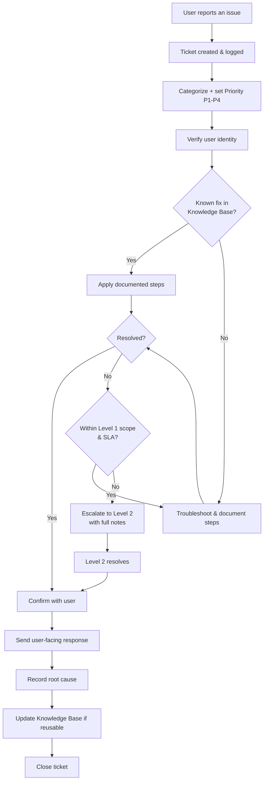

# Diagram — Help Desk Ticket Workflow

How a ticket flows through QueensTech's Level 1 Help Desk from intake to closure.

**Key points**
- Every ticket is categorized and prioritized before work begins.
- Identity is verified before any account action.
- The KB is checked first and updated after — the loop that makes support faster over time.
- Escalation always carries full documented notes.
