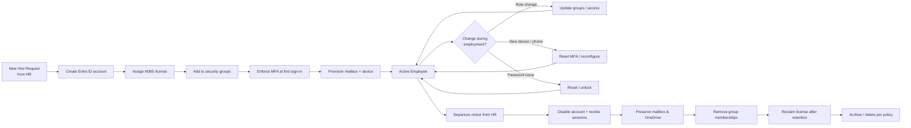

# Diagram — Microsoft 365 / Entra ID User Lifecycle

The identity lifecycle a user goes through at QueensTech, from hire to departure.

**Stages**
1. **Join** — account, license, groups, MFA, device.
2. **Move** — access, MFA, and password changes while employed.
3. **Leave** — disable, preserve data, reclaim license.
