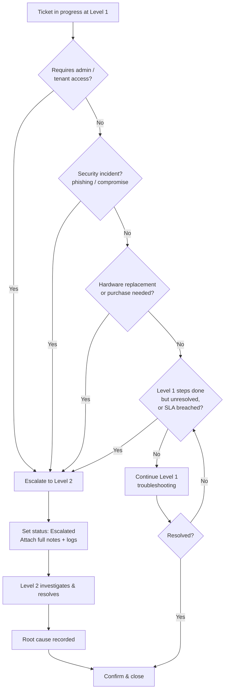

# Diagram — Ticket Escalation Flow

When and how a Level 1 ticket escalates to Level 2 at QueensTech.

**Escalate to Level 2 when:**
- Admin / tenant-level access is required (Conditional Access, licensing, groups).
- There is a security incident.
- Hardware replacement or a purchase must be approved.
- Level 1 steps are exhausted or the SLA is breached.
